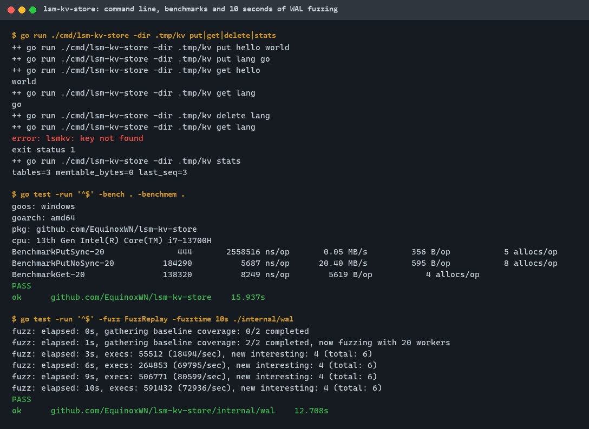
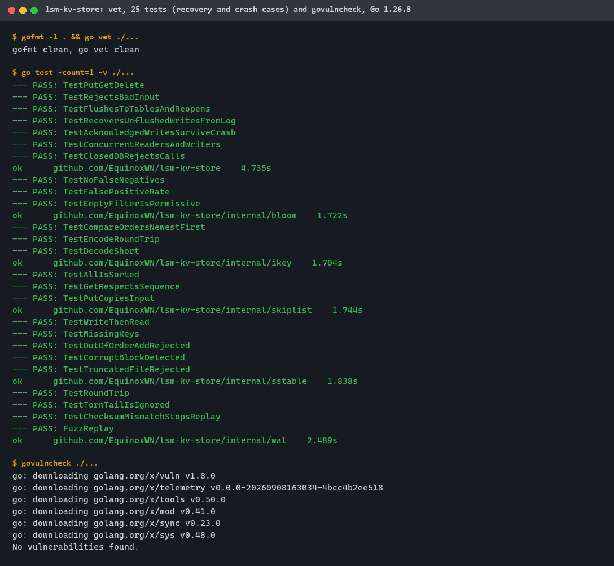
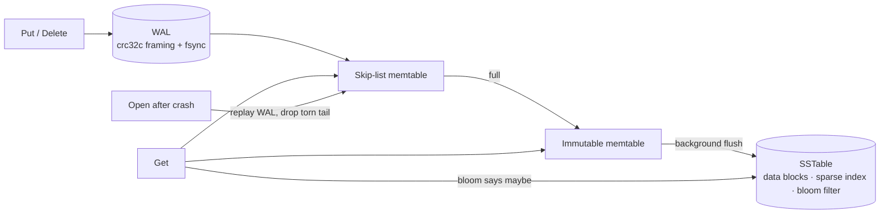
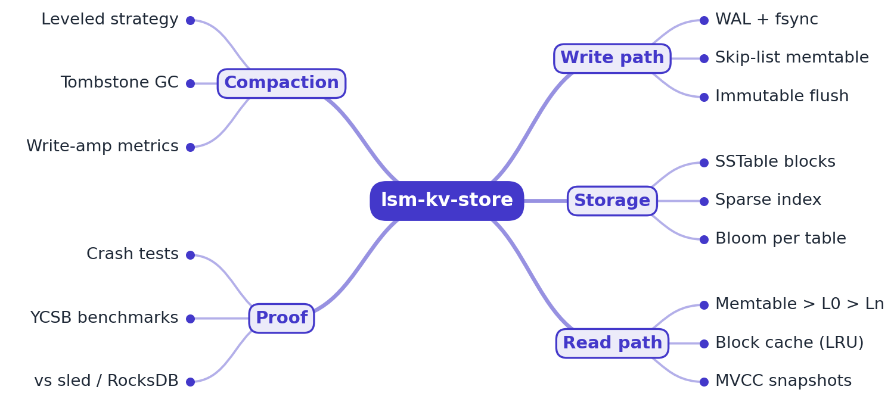
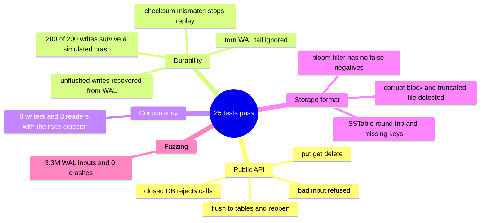

# lsm-kv-store

[](https://github.com/EquinoxWN/lsm-kv-store/actions/workflows/ci.yml)


> Why databases like Cassandra stay fast while writing constantly: a storage engine built to survive a crash without losing a single acknowledged write.

Part of my **Distributed Systems & Storage** list · Go · core project

## Proof it works

The command line stores, reads and deletes keys in a real on-disk store (each run reopens it from its WAL and SSTables), the benchmarks run, and ten seconds of fuzzing feed about 590,000 random byte strings to the WAL decoder without a crash:



25 tests pass, including recovery after a simulated crash, and govulncheck finds no vulnerabilities with Go 1.26.8, the version CI uses:



## Architecture

**What M1 runs today:**



**Full roadmap (M1 to M3):**



## How it works

_Steps 1 and 2 are built and tested (M1); the rest is on the [roadmap](#roadmap)._

1. Every put is appended to a write-ahead log and fsync'd, then inserted into a skip-list memtable keyed by (user key, sequence number).
2. When the memtable is full it becomes immutable and a background thread flushes it to a sorted SSTable with data blocks, a sparse index and a bloom filter.
3. Reads check the memtable, then L0, then each level. Bloom filters skip tables that cannot hold the key, so most misses never touch disk.
4. Leveled compaction merges overlapping SSTables into the next level, drops overwritten versions and old tombstones, and records write amplification per level.
5. Snapshots pin a sequence number, so readers see a consistent view while writes and compaction continue (MVCC).
6. A crash harness kills the process mid-WAL, mid-flush and mid-compaction, restarts, and asserts that no acknowledged write was lost.

## Tech stack

| Area | Tools |
|---|---|
| Core | Go, skip-list memtable, SSTables read with `ReadAt` (mmap is a later option, ADR 0002), crc32c checksums |
| Test | Go fuzzing, testing.B benchmarks, custom crash-injection harness |
| Docs | design doc, flame graphs, YCSB workloads |

Language: **Go** (standard library only).

| Path | What it is |
|---|---|
| `lsm.go` | Public API: `Open`, `Put`, `Get`, `Delete`, `Close`, recovery and background flush |
| `internal/wal` | Write-ahead log with crc32c records and torn-tail detection |
| `internal/skiplist` | Memtable ordered by (key, newest sequence first) |
| `internal/sstable` | Sorted table writer and reader: data blocks, sparse index, footer |
| `internal/bloom` | Per-table bloom filter |
| `cmd/lsm-kv-store` | Small CLI |

## Run it

```bash
make test    # unit, recovery and crash tests (with the race detector)
make bench   # write and read benchmarks
make fuzz    # fuzz the WAL decoder for 30 s
```

Or use it from the command line:

```bash
go run ./cmd/lsm-kv-store -dir /tmp/kv put hello world
go run ./cmd/lsm-kv-store -dir /tmp/kv get hello
```

Or as a library:

```go
db, err := lsmkv.Open("data", lsmkv.Options{})
if err != nil { return err }
defer db.Close()
err = db.Put([]byte("k"), []byte("v")) // durable when it returns
v, err := db.Get([]byte("k"))
```

## Tests and results

Latest local run (full detail in [docs/results/m1.md](docs/results/m1.md)):

| Check | Result |
|---|---|
| Unit, recovery and crash tests | 25 passed, 0 failed |
| Simulated crash with a torn WAL tail | 200 of 200 acknowledged writes recovered |
| WAL decoder fuzzing (30 s) | ~3.3M inputs, 0 crashes |
| Durable writes (fsync each) | ~430/s (2.34 ms each) |
| Writes without fsync | ~119,000/s |
| Point reads, 50k keys | ~65,000/s |

CI runs the same tests with the race detector on every push.

### Test map



## Roadmap

**M1** (≈15 h)
- [x] Write `docs/rfc/0001-design.md`: problem, goals, non-goals, chosen design
- [x] Every put is appended to a write-ahead log and fsync'd, then inserted into a skip-list memtable keyed by (user key, sequence number).
- [x] When the memtable is full it becomes immutable and a background thread flushes it to a sorted SSTable with data blocks, a sparse index and a bloom filter.

**M2** (≈20 h)
- [ ] Reads check the memtable, then L0, then each level. Bloom filters skip tables that cannot hold the key, so most misses never touch disk.
- [ ] Leveled compaction merges overlapping SSTables into the next level, drops overwritten versions and old tombstones, and records write amplification per level.

**M3** (≈25 h)
- [ ] Snapshots pin a sequence number, so readers see a consistent view while writes and compaction continue (MVCC).
- [ ] A crash harness kills the process mid-WAL, mid-flush and mid-compaction, restarts, and asserts that no acknowledged write was lost.
- [ ] Publish the proof below with real numbers

## Proof

What this repo must show before it counts as done:

- YCSB A/B/C throughput and p99 vs sled, read/write/space amplification per level, and a crash-test log with zero lost writes.

| Result | Value |
|---|---|
| M3 proof above | Not measured yet (M3). Current M1 numbers: see [Tests and results](#tests-and-results). |

## Why it matters

- **Interview angle:** 'Design a key-value store' and 'explain write amplification'.
- **Upstream I'm contributing to:** RocksDB (Meta) or Pebble (Cockroach Labs).

## Design docs

- [RFC 0001: design](docs/rfc/0001-design.md)
- [ADR 0001: record architecture decisions](docs/adr/0001-record-architecture-decisions.md)
- [ADR 0002: read SSTables with ReadAt before adopting mmap](docs/adr/0002-pread-before-mmap.md)

## Scope

This is a learning and portfolio system, not a hosted production service. Everything runs locally.

## Security and contributing

- Every GitHub Action is pinned to a commit SHA; workflows run read-only, without persisted credentials.
- Dependabot proposes dependency and action updates weekly.
- `go vet`, `gofmt` and the race detector on every push; `govulncheck` (`make audit`) in CI.
- Report vulnerabilities privately: see [SECURITY.md](SECURITY.md). To contribute, see [CONTRIBUTING.md](CONTRIBUTING.md).

## License

MIT, see [LICENSE](LICENSE).
